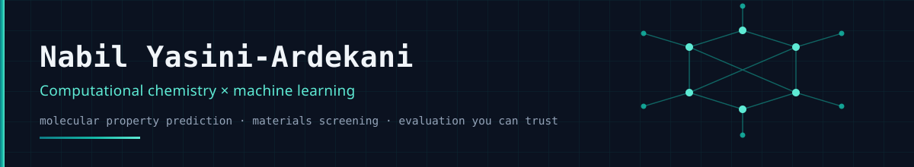

I build machine-learning models for molecules and materials, and I spend most of my
effort on the part that decides whether they mean anything: **the evaluation**.
Leakage-controlled splits, ablations that isolate one variable, pre-registered decision
rules, and negative results reported as negative.

Currently finishing an MSc in Artificial Intelligence at Queen Mary University of London.

---

## Selected work

| Project | What it is | The result that matters |
|---|---|---|
| **[FiltraNex](https://github.com/abinittio/filtranex)** · [live demo](https://abinittio.github.io/filtranex/) | Five-stage screening cascade for CNS stimulant candidates, with an applicability-domain gate | Predictive accuracy is a function of distance from training chemistry — so every result ships with a confidence tier instead of a bare number |
| **[StereoAwareGNN](https://github.com/abinittio/StereoAwareGNN)** | Protocol-controlled BBB permeability benchmark: 8 architectures × 3 evaluation protocols | ChemBERTa tops the random split at 0.958 and drops to 0.746 external; a fingerprint random forest gives up 0.005 and finishes first. Protocol moves the score more than architecture does |
| **[bbb-honest-eval](https://github.com/abinittio/bbb-honest-eval)** | The leakage audit behind that correction | Reproduces an inflated 0.96 "external" AUC, isolates the dataset overlap that caused it, and publishes the corrected figures |
| **[In-silico drug discovery toolkit](https://github.com/abinittio/Insilico-Drug-Discovery-Toolkit)** | Multi-endpoint ADMET platform: transporters, abuse liability, hERG, CYP450, BBB | Transporter ROC-AUC 0.968 (scaffold split, in-dataset), plus a SMARTS rules engine for known failure modes |
| **[CYP450 metabolism predictor](https://github.com/abinittio/CYP450-Metabolism-Predictor)** | Multi-task GNN over five major CYP isoforms | Drug–drug interaction liability from structure alone |
| **[DoseTrack](https://github.com/abinittio/dosetrack-v4)** | PK/PD simulation for lisdexamfetamine: prodrug conversion, RK4 integration, tolerance dynamics | A continuous physiological state estimator behind a minimal logging interface |
| **MGT for CO₂ capture** *(private until examination)* | Ablation study of the Molecular Graph Transformer's long-range attention channel on 25,000 metal–organic frameworks | The channel is worth 24% lower error — but the gain appears in only 2 of 3 random initialisations, survives a capacity-matched control, and is **not** improved by feeding it real partial charges |

---

## How I work

- **Controls before conclusions.** If two models differ in more than one way, the
  comparison cannot attribute anything. Ablate one variable, hold the rest fixed.
- **Pre-register the decision rule.** Minimum effect size and pass/fail criteria go into
  the repository *before* the runs, so a negative result cannot be reinterpreted later.
- **Publish the correction.** When a headline number turns out to be leakage, the
  retraction stays in the record next to the corrected figure.
- **Say what a model cannot do.** Applicability domains, failure modes and out-of-scope
  chemistry are part of the deliverable, not an appendix.

## Toolchain

`PyTorch` · `PyTorch Geometric` · `DGL` · `RDKit` · `pymatgen` · `scikit-learn` ·
`pandas` · `Flask` / `Streamlit` · GPU work on Kaggle and Colab

## Elsewhere

[nabil.engineer](https://nabil.engineer) · [LinkedIn](https://www.linkedin.com/in/nabil-yasini-ardekani)
